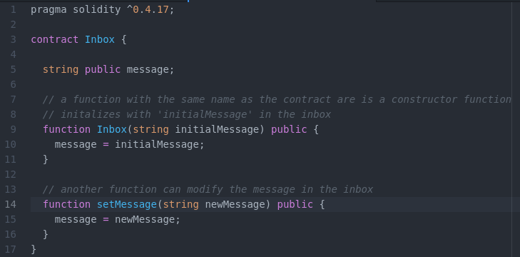
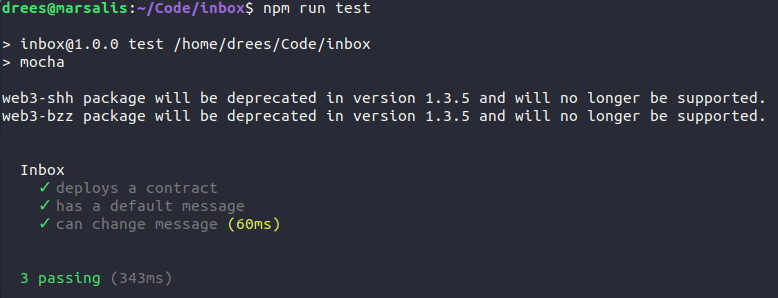
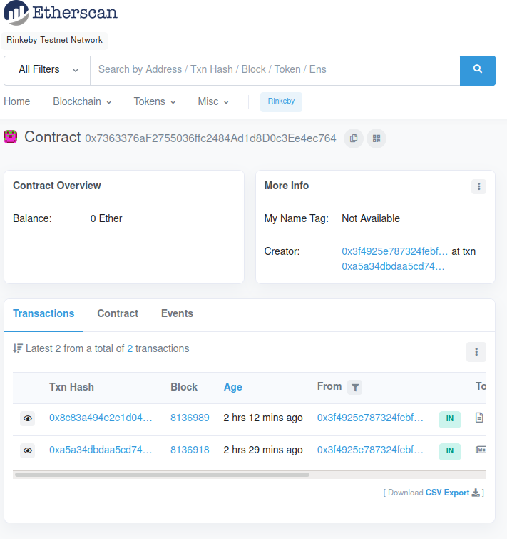

This project was completed as part of the Udemy course "Ethereum and Solidity: The Complete Developer's Guide."

# A Simple Solidity Smart Contract

A contract is stored in `./contracts/Inbox.sol`.



This contract simulates an inbox. The inbox stores a `message` in the contract data. Users can view the message and modify it with the `setMessage()` function.

When the contract is first deployed, the constructor function `Inbox()` initializes `message` as `initialMessage`, which must be passed as an argument with the deployment transaction. Note that the constructor function must have the same name as the contract. Deploying the contract requires that a transaction be submitted containing the compiled contract bytecode.

A second function `setMessage()` allows a user to modify the message stored in the inbox. Modifying the message requires that a transaction be submitted to the contract address.

At any point, the message can be accessed from the contract data using the `message()` method. Viewing the message is virtually instantaneous and does not require a transaction.

# Compile the contract

Use the command `$ node compile.js` to compile the contract.

## Contract bytecode and ABI

The compiler returns a JSON object containing the contract `bytecode` and `ABI`.
- The bytecode is submitted to the EVM with the transaction that deploys the contract.
- The ABI specifies the contract functions, arguments, and variables to provide an interface for javascript testing and deployment scripts to interact with.

```sh
bytecode:
 '6060604052341561000f57600080fd5b60405161038e38038061038e833981016040528080519091019050600081805161003d929160200190610044565b50506100df565b828054600181600116156101000203166002900490600052602060002090601f016020900481019282601f1061008557805160ff19168380011785556100b2565b828001600101855582156100b2579182015b828111156100b2578251825591602001919060010190610097565b506100be9291506100c2565b5090565b6100dc91905b808211156100be57600081556001016100c8565b90565b6102a0806100ee6000396000f300606060405263ffffffff7c0100000000000000000000000000000000000000000000000000000000600035041663368b87728114610047578063e21f37ce1461009a57600080fd5b341561005257600080fd5b61009860046024813581810190830135806020601f8201819004810201604051908101604052818152929190602084018383808284375094965061012495505050505050565b005b34156100a557600080fd5b6100ad61013b565b60405160208082528190810183818151815260200191508051906020019080838360005b838110156100e95780820151838201526020016100d1565b50505050905090810190601f1680156101165780820380516001836020036101000a031916815260200191505b509250505060405180910390f35b60008180516101379291602001906101d9565b5050565b60008054600181600116156101000203166002900480601f0160208091040260200160405190810160405280929190818152602001828054600181600116156101000203166002900480156101d15780601f106101a6576101008083540402835291602001916101d1565b820191906000526020600020905b8154815290600101906020018083116101b457829003601f168201915b505050505081565b828054600181600116156101000203166002900490600052602060002090601f016020900481019282601f1061021a57805160ff1916838001178555610247565b82800160010185558215610247579182015b8281111561024757825182559160200191906001019061022c565b50610253929150610257565b5090565b61027191905b80821115610253576000815560010161025d565b905600a165627a7a72305820ab4d99725591694818db767207504b03dc46c6037b568fd53eb68011581b93080029',
interface:
 '[{"constant":false,"inputs":[{"name":"newMessage","type":"string"}],"name":"setMessage","outputs":[],"payable":false,"stateMutability":"nonpayable","type":"function"},{"constant":true,"inputs":[],"name":"message","outputs":[{"name":"","type":"string"}],"payable":false,"stateMutability":"view","type":"function"},{"inputs":[{"name":"initialMessage","type":"string"}],"payable":false,"stateMutability":"nonpayable","type":"constructor"}]'
```

# Testing the contract

Run the test with `$ npm run test`. This command runs the script at `./test/inbox_test.js` using the `mocha` javascript testing framework.

Three basic functionality checks are written:
- The contract can be deployed locally
- Users can access the message stored in the inbox
- Users can modify the message



# Deploy contract to testnet

`./deploy.js` contains the script to deploy the contract to the Rinkeby testnet.  However, two important variables have been excluded from the git repo for security reasons: `MNEMONIC` and `RINKEBY_ENDPOINT`.
- Replace `RINKEBY_ENDPOINT` with a string containing the [infura API](https://infura.io/) https endpoint. You must create an account and project to view the endpoint. This allows you to interact with the Rinkeby testnet without having to run a full node.
- Replace `MNEMONIC` with a string containing the 12 word seed phrase for your HD wallet. Fund the wallet from a [Rinkby faucet](https://faucet.rinkeby.io/), as ETH is needed to deploy the contract and modify its data (though not to view it).
- Deploy the contract with `$ node deploy.js`

Note that the address of the deployed contract is shown in the console logs:
```
Contract deployed to 0x7363376aF2755036ffc2484Ad1d8D0c3Ee4ec764
```

# View contract on etherscan

Go to [Rinkeby Etherscan](https://rinkeby.etherscan.io/) and enter the contract address to see it.




Note that the contract bytecode can be decompiled to its source code, such that it may be audited by anybody.

# Interact With Contract in Remix

The `Injected Web3` environment allows the [Remix browser](http://remix.ethereum.org/) to interact with contracts that are deployed on Ethereum mainnet or testnets. You must still compile the contract code in remix, but rather than deploying the contract, you may access the pre-deployed contract at its address.

Test the functionality of `setMessage()`. The transaction will require gas and take ~15 seconds to execute. It is important to test contracts with the asynchronous processes imposed by decentralized blockchains. The message can be accessed with `message()`.

[Remix Test](figs/remix_test.png)

# Appendix: Setup and Dependencies

`$ npm init` initalized a new node project and created the `package.json` file in the project directory. Update `package.json` file such that `scripts-->test = "mocha"`

```sh
$ npm install --save truffle-hdwallet-provider
$ npm install --save solc@0.4.17
$ npm install --save mocha
$ npm install --save ganache-cli
$ npm install --save web3@1.0.0-best-26
```
